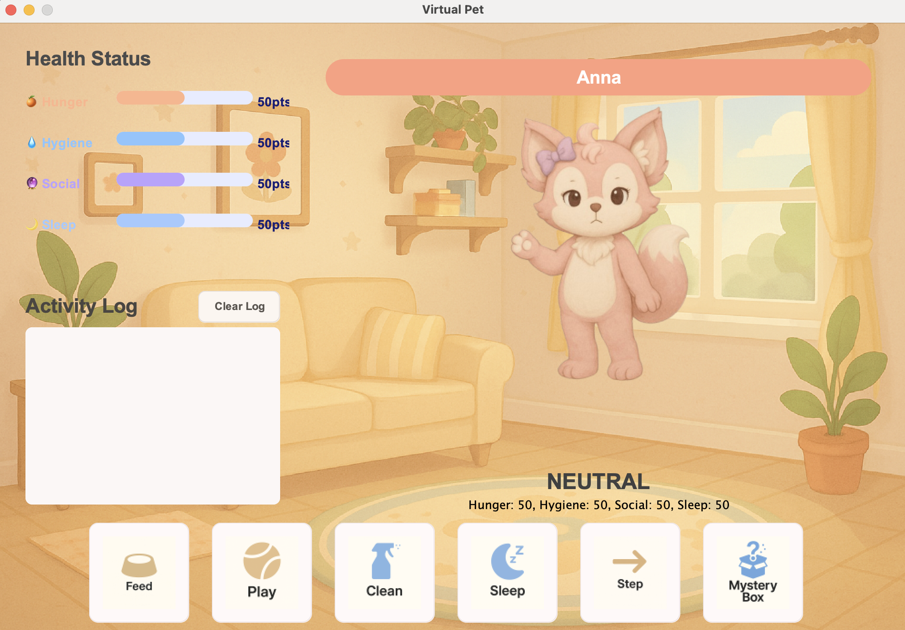
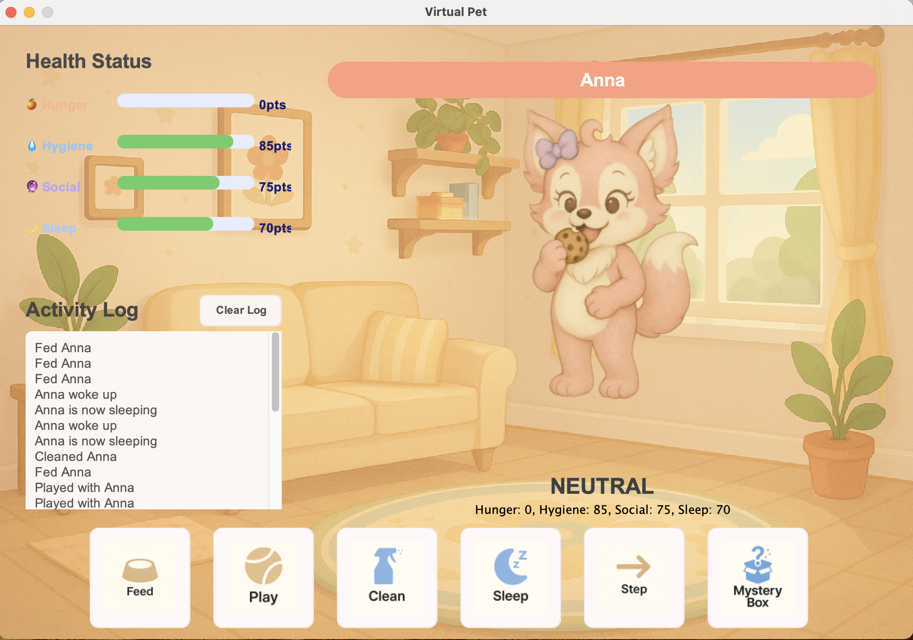

# Virtual Pet

## Overview

**Virtual Pet** is a desktop application that simulates the experience of caring for a digital pet. Users can feed, play with, clean, and put their pet to sleep, while also encountering random events through a "Mystery Box" feature. The application provides a rich, interactive GUI and leverages modern Object-Oriented Programming (OOP) principles and design patterns.

## Features

- **Interactive GUI:** Built with Java Swing for a responsive and visually appealing user experience.
- **Pet Health Management:** Track and manage your pet's Hunger, Hygiene, Social, and Sleep stats.
- **Activity Log:** See a history of all actions and events affecting your pet.
- **Mood System:** The pet's mood (Happy, Neutral, Sad) changes based on its health and your interactions.
- **Mystery Box:** Random events can help or hinder your pet, adding excitement and unpredictability.
- **OOP Design:** Clean, extensible codebase using interfaces, enums, and design patterns (Strategy, MVC).

## Technologies Used

- **Java 17+**
- **Java Swing** (for GUI)
- **OOP Principles:** Encapsulation, Inheritance, Polymorphism, Abstraction
- **Design Patterns:** Model-View-Controller (MVC), Strategy Pattern, Interface-based programming, Enum usage

## Object-Oriented Design

### Model-View-Controller (MVC)

- **Model:** Classes like `Pet`, `HealthStatus`, and `MysteryBox` encapsulate the application's data and business logic.
- **View:** The `PetView` and its components (`HealthPanel`, `ActivityLogPanel`, etc.) handle all GUI rendering and user input.
- **Controller:** `PetController` acts as the intermediary, updating the model and view in response to user actions.

### Strategy Pattern

- The pet's mood behavior is implemented using the Strategy pattern:
  - `MoodStrategy` interface
  - Concrete strategies: `HappyMoodStrategy`, `NeutralMoodStrategy`, `SadMoodStrategy`
- This allows the pet's response to actions to change dynamically based on its mood.

### Interfaces and Enums

- **Interfaces:** `PetInterface`, `MysteryBox`, and `MoodStrategy` define contracts for extensibility and loose coupling.
- **Enums:** `Action` and `MoodEnum` provide type-safe representations of possible actions and moods.

### Mystery Box System

- The `MysteryBoxSystem` randomly generates different types of boxes (`CommonBox`, `RareBox`), each implementing the `MysteryBox` interface.
- Each box can have unique effects on the pet, demonstrating polymorphism and encapsulation.

## How to Run

1. **Clone the repository** and ensure you have Java 17 or higher installed.
2. **Build the project** (if not already built):
   ```sh
   javac -d out src/main/MyPetMain.java
   ```
3. **Run the application:**
   ```sh
   java -cp out main.MyPetMain
   ```
   Or, if you have the provided JAR:
   ```sh
   java -jar res/VirtualPet.jar
   ```

## File Structure

```
src/
  main/                # Entry point
  controller/          # PetController (MVC Controller)
  pet/
    model/             # Pet, HealthStatus, MysteryBox, etc. (MVC Model)
    strategy/          # Mood strategies (Strategy Pattern)
    enums/             # Action and MoodEnum
  view/                # PetView and GUI components (MVC View)
res/
  images/              # All image assets and screenshot
test/                  # Unit tests
```

## Screenshot




## Credits

- All code and artwork are original or used with permission.

---

**Enjoy taking care of your virtual pet!**